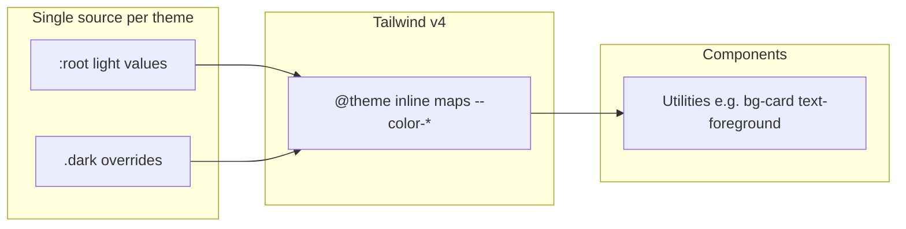

# Design tokens (Gecko Elements)

This document is the **single source of truth** for how we use design tokens: where semantic tokens are required, how new tokens are named, and the **light + dark** rule for color.

**Implementation:** Token values and Tailwind v4 bridging live in [`src/index.css`](../src/index.css) (`:root`, `.dark`, and `@theme inline`). [`components.json`](../components.json) uses `cssVariables: true` (shadcn-compatible).

**Theme switching:** The app uses `next-themes` with class-based dark mode; CSS uses `@custom-variant dark` targeting `.dark`, consistent with that setup.

---

## Contract: where tokens are strict vs loose

| Area | Rule |
|------|------|
| `src/components/ui/**` | Use **semantic tokens only** (`bg-background`, `bg-card`, `border-border`, `text-muted-foreground`, `bg-primary`, status tokens such as `destructive` / `success`, `sidebar-*`, etc.). Do not use `bg-white`, `bg-gray-*`, `border-gray-*`, or palette steps for product meaning unless a **new semantic token** is added in `index.css` first. |
| `src/components/layout/**` and other shared app chrome | Same as UI primitives: semantic tokens so shells and navigation match light and dark themes. |
| `src/pages/**` | Raw Tailwind palette utilities are allowed **only** for **documentation and gallery** content (for example core color scale pages, radius or shadow demos that illustrate default Tailwind steps). Prefer keeping such usage in obvious demo sections or small local wrappers. |

---

## Naming convention

- **Extend the existing shadcn-style vocabulary.** New color semantics use **`--kebab-case`** CSS variables in `:root` and `.dark`: names aligned with the ecosystem you already use (`background`, `foreground`, `card`, `muted`, `border`, `primary`, `destructive`, `*-foreground`, `*-muted`, `sidebar-*`, `chart-*`).
- **Adding a new semantic:** Define the variable in **both** `:root` and `.dark`, then map it in `@theme inline` as `--color-<name>` so utilities like `bg-<name>` and `text-<name>` exist.
- **Optional aliases:** If design docs refer to “surface” or “raised”, you may add **Tailwind-only** aliases in `@theme inline` that point at existing variables (for example `--color-surface: var(--background)`) **without** duplicating OKLCH literals—theme values stay in one place per mode.
- Avoid introducing a **second parallel naming system** in `:root` without a documented mapping table; prefer `@theme` aliases when vocabulary differs from shadcn defaults.

### Mental model (examples)

These are illustrative; the canonical names remain the CSS variables in `index.css`.

| Role | Typical token / utility |
|------|-------------------------|
| Page background | `--background` / `bg-background` |
| Default text | `--foreground` / `text-foreground` |
| Secondary text | `--muted-foreground` / `text-muted-foreground` |
| Elevated surface (card, panel) | `--card` / `bg-card` (or `popover` where appropriate) |
| Muted fill / subtle strip | `--muted` / `bg-muted` |
| Default border | `--border` / `border-border` |
| Focus ring | `--ring` / `ring-ring` |
| Primary action | `--primary` / `bg-primary`, `text-primary-foreground` |
| Destructive | `--destructive` / `bg-destructive`, `text-destructive` (and muted variants where defined) |

---

## Dark mode rule

- Any **new** CSS variable used for **UI color** must be assigned in **both** `:root` (light) and **`.dark`** (dark) in [`src/index.css`](../src/index.css) before merge.
- Do not ship a new color token with light-only values.

### Contributor checklist (new or updated color tokens)

1. Add the variable to `:root` with the light value.
2. Add the same variable to `.dark` with the dark value.
3. Expose it in `@theme inline` as `--color-*` if it should be used via Tailwind utilities.
4. Manually verify: toggle dark mode in the app on a screen that uses the change; contrast and borders should remain intentional.

---

## Token flow

---

## Related standards

- App architecture and structure: [architecture.md](./architecture.md)
- Component authoring: [component-template.md](./component-template.md)
